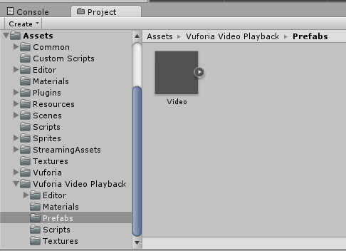
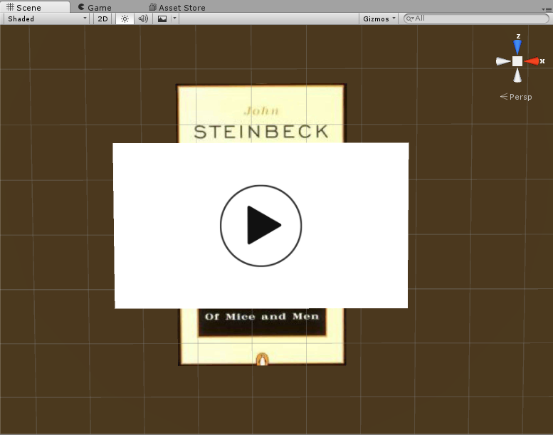
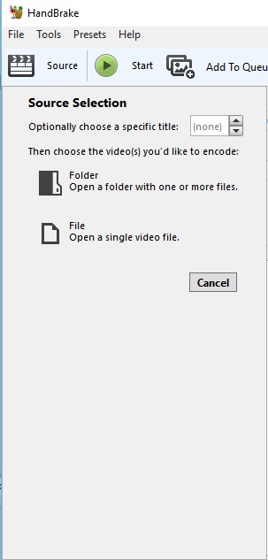
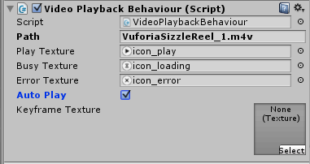
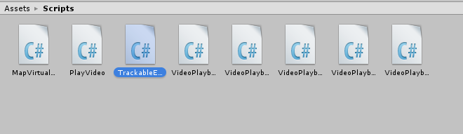

## Lesson Goals

In this tutorial, you will learn how to:

* add native and streaming video overlays
* add audio overlays
* compress video files in [Handbrake](https://handbrake.fr/)


This lesson is an extension of [Introduction to Mobile Augmented Reality Development in Unity](http://programminghistorian.github.io/ph-submissions/lessons/intro-to-ar-development). Make sure that you have completed all of the "lesson goals" in this introductory lesson before continuing.
 
## Video Overlays

Video overlays are a great way to incorporate more dynamic content into your augmented reality project. Even something as simple as a slideshow with a narrated voice-over can go a long way in extending the rhetorical possibilities of your application. For instance, the manager of an historic site could create an augmented reality application that overlays video interviews from historians, actors, or local residents within the physical space of the site.

## Software Requirements

First, make sure you have satisfied all of the software requirements as described in the [Introductory lesson](http://programminghistorian.github.io/ph-submissions/lessons/intro-to-ar-development).

Download [Handbrake](https://handbrake.fr/). Handbrake is a free, open source video encoder. We will use this to compress the video files before adding them as overlays in Unity.
  
## Downloading and adding the video prefab

Go to the [Vuforia Developer Portal "Samples" page](https://developer.vuforia.com/downloads/samples). Scroll down to the "Advanced Topics" section and click on the "Download for Unity" option to the right. This will download a compressed folder with several different packages  showcasing some of the advanced functions of the Vuforia SDK. Once the folder has downloaded, unzip the files to an appropriate location on your computer. The package we will be using for this lesson is named "VideoPlayback.unitypackage." 


Open Unity and use the same project and scene file you created in the previous tutorial. Delete any image overlays and/or audio source components you created for your image target. Import the "VideoPlaback.unitypackage" by going to "Assets > Import Package > Custom Package." When the package has finished importing, you should see a new folder called "Vuforia Video Playback" within your project structure. Click on the "Prefabs" folder within this folder and drag the "Video" prefab onto your Image Target game object in the Hierarchy panel.



Your scene view panel should now look something like this.



## Compressing video files in Handbrake

For this section of the lesson, you will need a video file. This can be a file that you created yourself or one that you downloaded. However, before we import it into Unity, we will need to compress the file in [Handbrake](https://handbrake.fr/) so that it loads faster on mobile devices. If your file is already fairly small (under 10mb), then you can skip this step. Alternatively, you can use one of the two sample video files that Vuforia includes in its sample package. These files are in the "Streaming Assets" folder and they are named "VuforiaSizzleReel_1.m4v" and "VuforiaSizzleReel_2.m4v."

Once you have a video file, open up handbrake and locate your file by clicking on the "Source" button in the upper right and choosing the "File" option in the window that appears.



Click the "Browse" button and give your file a name and destination. Set the "Output Setting" to "MP4" and hit "Start." Your compressed video file will be available shortly. When your video is finished compressing, locate it in your file explorer and rename the file extension from ".mp4" to ".m4v".

## Connecting video files to the "Video" prefab

Return to Unity and drag your compressed .m4v video file into the "Streaming Assets" folder along with Vuforia's two sample video files. Click on the "Video" prefab in your Hierarchy panel and navigate to the "Video PLayback Behaviour" component in the Inspector. In the field labelled "Path," type the exact name of your video file along with the .m4v file extension. Select "Auto Play" and save your scene. If you prefer to stream your video, type the exact URL of the video file using the ".mp4" file extension. The streaming option will only work if your URL points to a video file, not a website that hosts video files such as YouTube or Vimeo. 



Next, select your Image Target game object and delete the "Default Trackable Event Handler" script component in the inspector panel. Click on the "Add Component" button and add the "TrackableEventHandler" script to replace the default script. This script is located in the "Assets > Scripts" folder. Save your scene and export your project to a mobile device to test your video overlay.



## Add an Audio Overlay

Make sure that your "ImageTarget" game object is selected in the Hierarchy panel. In in the inspector panel, scroll to the bottom and select "Add Component." Search for "audio source" and add it to your ImageTarget. Deselect the "Play On Awake" box in the audio source component. If left selected, your audio will begin playing as soon as the application starts rather than when the user scans your trigger image.

Next, you will need to find an mp3 file to test if your audio overlay is working. If you do not have any audio files handy, you can download a copyright-free mp3 at [soundbible.com](http://soundbible.com/). Once you have located your mp3, drag it into your assets folder in your project panel. Once the file has imported into Unity, drag it into the "AudioClip" section of the Audio Source component in your ImageTarget gameobject.



In order to get the audio file to play when the trigger image is scanned, you will need to create your own C# script and attach it to your ImageTarget. To do this, make sure the Image Target is selected in the scene view and click on "Add Component" in the inspector panel. Then, scroll down to the bottom of the menu to select "New Script." Make sure the scripting language is set to "C#" and rename it "PlayAudio." The new script will be added to your root "Assets" folder in the project panel. Double-click on the script to open it in Monodevelop. Copy and paste the code below into your "PlayAudio" script. Save the file and return to Unity.

```C#
using UnityEngine;
using System.Collections;
using Vuforia;

public class PlayAudio : MonoBehaviour,
ITrackableEventHandler
{
    private TrackableBehaviour mTrackableBehaviour;
    
    void Start()
    {
        mTrackableBehaviour = GetComponent<TrackableBehaviour>();
        if (mTrackableBehaviour)
        {
            mTrackableBehaviour.RegisterTrackableEventHandler(this);
        }
    }
    
    public void OnTrackableStateChanged(
        TrackableBehaviour.Status previousStatus,
        TrackableBehaviour.Status newStatus)
    {
        if (newStatus == TrackableBehaviour.Status.DETECTED ||
            newStatus == TrackableBehaviour.Status.TRACKED ||
            newStatus == TrackableBehaviour.Status.EXTENDED_TRACKED)
        {
            // Play audio when ImageTarget is found
            GetComponent<AudioSource>().Play();
        }
        else
        {
            // Stop audio when ImageTarget is lost
            GetComponent<AudioSource>().Stop();
        }
    }   
}
```

This C# script uses Vuforia's "ITrackableEventHandler" to determine if the trigger image is within the camera view. If it is, it will search for the audio source component attached to the ImageTarget game object and play it. If the camera stops tracking the trigger image, then the audio source will pause.
